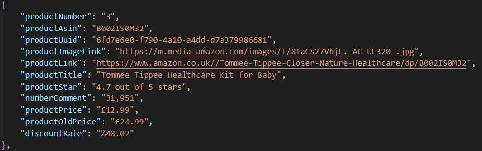
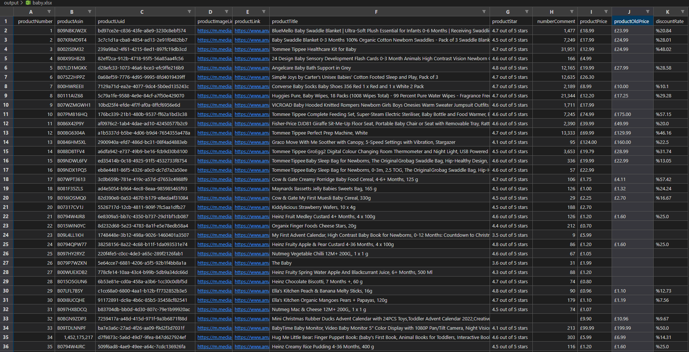

# Web Scraper | Scrapy (Python)

## Decoupling data of searched results with Amazon UK

### Received Data

*   product number => In the received data, the sorting of products increases one by one.
*   product asin => The asin code of the product in amazon.
*   product uuid => The uuid code of the product on Amazon.
*   product image link => Link information of the product picture.
*   product link => Link information to which the product belongs.
*   product title => Product title information.
*   product star => The star information the product receives.
*   number comment => The number of comments the product receives.
*   product price => The selling price of the product.
*   product old price => If there is a discount on the product, information about the old price.
*   discount rate => Finding the discount percentage on the product with the developed function.

### A json example of a product from the received data :



***You can see all the outputs (csv, json and xml) from the Output folder.***

***

## EXCEL Output



***

## Information about the developed code

### **settings.py** What I added to the file :

```python
# Write your own user agent information for the most accurate result.
# It can be learned by typing my user agent in the browser.
USER_AGENT =  'Mozilla/5.0 (Windows NT 10.0; Win64; x64) AppleWebKit/537.36 (KHTML, like Gecko) Chrome/93.0.4577.82 Safari/537.36'
# robots.txt if you want to comply with the written rule, please do True, if you want not to comply, do False.
ROBOTSTXT_OBEY = False
# I added utf-8 standards to the output so that it looks good.
FEED_EXPORT_ENCODING = 'utf-8'
# I added the item class I added while taking the output so that it appears in the order I want.
FEED_EXPORT_FIELDS=['productNumber','productAsin','productUuid','productImageLink','productLink','productTitle','productStar','numberComment','productPrice','productOldPrice','discountRate']
```

### **items.py** The change I made to the file :

```python
import scrapy

# It will be enough to enter the information of the data you want to receive.

class AmazonItem(scrapy.Item):
    productNumber = scrapy.Field()
    productAsin = scrapy.Field()
    productUuid = scrapy.Field()
    productImageLink = scrapy.Field()
    productLink = scrapy.Field()
    productTitle = scrapy.Field()
    productStar = scrapy.Field()
    numberComment = scrapy.Field()
    productPrice = scrapy.Field()
    productOldPrice = scrapy.Field()
    discountRate = scrapy.Field()
```

### **amazon_search.py** The data extraction process starts here. It is basically divided into two functions, the first is start_url, the second is parse.

**start_url** =>

```python
# User data is taken here.
search = []
category = int(input(f"page data : Please specify product category. (Exp: (Enter :) ) => All category) => "))
text = input(f"page data : Please enter search text. (Exp : baby car) => ")
search.append(f'https://www.amazon.co.uk/s?k={text}&i={category}')

# The list created with the data received from the user is used by the following function.
# Thanks to this function, the connection is visited. The data is redirected to the parse function for the extraction process.
start_urls = search
    for url in start_urls:
        print(f'url bilgisi => {url}')
        yield scrapy.Request(url=url, callback=self.parse)

```

**parse** =>

```python
def parse(self, response):
    # The AamazonItem class is held in the items variable.
    items = AmazonItem()

    # The xpath path of the products whose data is requested to be taken within the page is kept here. As an output, the class returns.
    products = response.xpath("//div[@data-component-type='s-search-result']")
    # The list of products is navigated one by one with the for loop.
    for product in products:
        # The xpath and css selector information of the data requested to be retrieved are written here.
        productNumber = product.xpath(".//div/div/@data-csa-c-pos").get()
        productAsin = product.xpath(".//@data-asin").get()
        productUuid = product.xpath(".//@data-uuid").get()
        productImageLink = product.css(".s-latency-cf-section.s-card-border .s-image-square-aspect .s-image").css('::attr(src)').get()
        productLink = product.css(".s-latency-cf-section.s-card-border .s-height-equalized > span > a").css("::attr(href)").get()     
        productTitle = product.css(".s-latency-cf-section.s-card-border h2.a-size-mini").css("::text").get()
        productStar = product.css(".s-latency-cf-section.s-card-border .aok-align-bottom > span").css("::text").get()
        numberComment = product.css(".s-latency-cf-section.s-card-border .s-link-style .s-underline-text").css("::text").get()
        productPriceOne = product.css(".s-latency-cf-section.s-card-border .a-price-whole").css("::text").get()
        productPriceTwo = product.css(".s-latency-cf-section.s-card-border .a-price-fraction").css("::text").get()
        productOldPrice = product.css(".s-latency-cf-section.s-card-border .a-text-price .a-offscreen").css("::text").get()
        sterlinIcon = '£'
        productPrice = None
        if productPriceOne and productPriceTwo is None:
            productPrice = None
        elif productPriceOne and productPriceTwo is not None:
            productPrice = f'{sterlinIcon}{productPriceOne}.{productPriceTwo}'
        
        discountRateTwo = None
        if productOldPrice is None:
            pass
        elif productOldPrice is not None:
            discountPrice = productOldPrice.lstrip("£")
            orginalPrice = productPrice.lstrip("£")
            discountRateOne = (1 - float(orginalPrice) / float(discountPrice)) * 100
            discountRateTwo = str(round(discountRateOne, 2))
            discountRateTwo = f'%{discountRateTwo}'
        
        # Data is saved in the Amazonite class.
        items['productNumber'] = productNumber
        items['productAsin'] = productAsin
        items['productUuid'] = productUuid
        items['productImageLink'] = productImageLink
        items['productLink'] = f'https://www.amazon.co.uk/{productLink}'
        items['productTitle'] = productTitle
        items['productStar'] = productStar
        items['numberComment'] = numberComment
        items['productPrice'] = productPrice
        items['productOldPrice'] = productOldPrice
        items['discountRate'] = discountRateTwo
        
        yield items 

    # After the data is taken on one page, the link information of the next page is retrieved using the xpath selector.               
    next_page = response.xpath("//div[@role='navigation' and @class='a-section a-text-center s-pagination-container']/span[@class='s-pagination-strip']/a[@class='s-pagination-item s-pagination-next s-pagination-button s-pagination-separator']/@href").get()

    # If there is information about the next page, go to the next page and run the parse function again. If there is no link information, the code stops.   
    if next_page:
        full_link = f'https://www.amazon.co.uk/{next_page}'
        print(f"sonraki sayfa link => {full_link}")
        yield scrapy.Request(url=full_link, callback=self.parse)
    
    # Opens the visited pages in the browser.
    open_in_browser(response)
```

### Running the developed code in the terminal :

*   Executes the code but does not save the output.

```cmd
    sracpy crawl amazon_search
```

*   To save the output :
    *   csv save :
    ```terminal
        scrapy crawl amazon_search -o test.csv
    ```
    *   json save :
    ```terminal
        scrapy crawl amazon_search -o test.json
    ```
    *   xml save :
    ```terminal
        scrapy crawl amazon_search -o test.xml
    ```

***

## Two python pages I added to help me

### **data_reading.py** :
* I added the json output to be able to read it on the terminal screen.

```python
import json

with open('baby.json') as f:
  datas = json.load(f)

for data in datas:
    print(data)
    print(f" data rading (productNumber) => {data['productNumber']}")
    print(f" data rading (productAsin) => {data['productAsin']}")
    print(f" data rading (productUuid) => {data['productUuid']}")
    print(f" data rading (productImageLink) => {data['productImageLink']}")
    print(f" data rading (productLink) => {data['productLink']}")
    print(f" data rading (productTitle) => {data['productTitle']}")
    print(f" data rading (productStar) => {data['productStar']}")
    print(f" data rading (CommentNumber) => {data['CommentNumber']}")
    print(f" data rading (productPrice) => {data['productPrice']}")
    print(f" data rading (productOldPrice) => {data['productOldPrice']}")
    print(f" data rading (discountRate) => {data['discountRate']}") 
```

### **csv_to_xlsx** : 
* It converts the csv format page to xlsx format for easy opening in excel file.

```python
from pyexcel.cookbook import merge_all_to_a_book
import glob

csv_file = 'baby'
xlsx_file = 'baby'

merge_all_to_a_book(glob.glob(f"output/{csv_file}.csv"), f"output/{xlsx_file}.xlsx")
```

***

### Source

*   The documentation (including installation and usage) can be found at:  [Scrapy official site](https://docs.scrapy.org/en/latest/)
